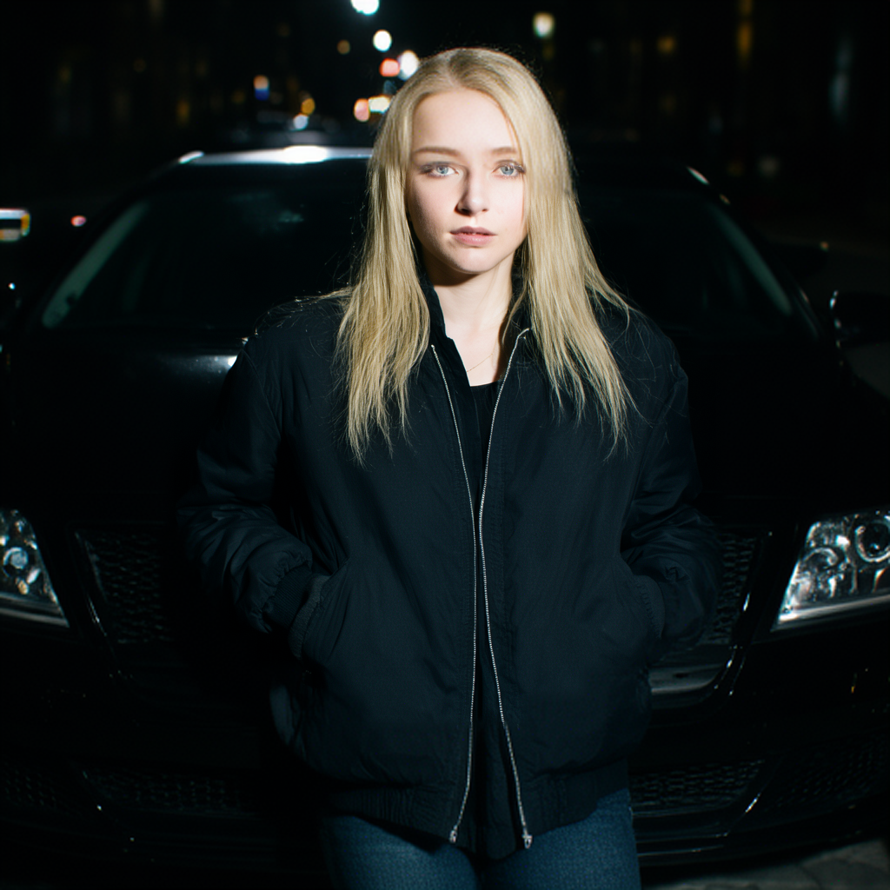
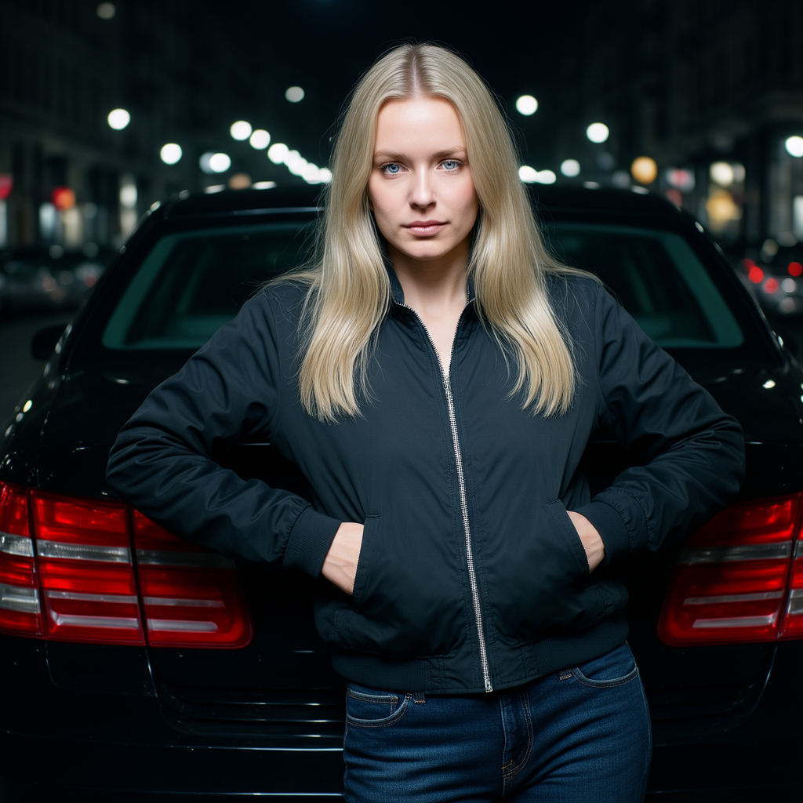
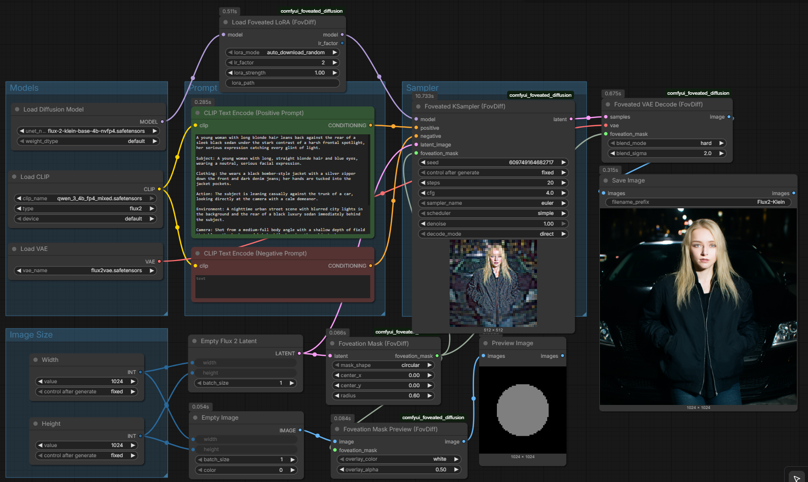

# ComfyUI-Foveated-Diffusion

FLUX.2 Klein foveated generation for ComfyUI — implements the paper
*"Foveated Diffusion: Prioritized Distortion for Efficiency"* (Brian Chao et al., Stanford 2026).

**Speed:** 2–4× faster generation by processing peripheral image regions at lower resolution while maintaining full quality in the foveal region.

## Paper & Resources
- **Paper Website:** [Foveated Diffusion Project Page](https://bchao1.github.io/foveated-diffusion/)
- **Original Source Code:** [GitHub - bchao1/foveated_diffusion](https://github.com/bchao1/foveated_diffusion)
- **Paper Link:** [arXiv:2603.23491 (2026)](https://arxiv.org/abs/2603.23491)
- **HuggingFace Models:** [bchao1/foveated-diffusion on Hugging Face](https://huggingface.co/bchao1/foveated-diffusion)

---

## ⚡ Performance Comparison
Foveated diffusion reduces the sequence token length by running lower resolution steps in the peripheral blocks. 
For **FLUX.2 Klein (20 steps)** generation:

* **Standard FLUX.2 Klein:** **~17.0 seconds**
* **Foveated FLUX.2 Klein (Circular, radius 0.60):** **~10.0 seconds** (~1.7× DIT speedup)
* **Foveated FLUX.2 Klein (Circular, radius 0.30):** **~6.5 seconds** (~2.6× DIT speedup)

### Image Comparison (Foveated vs. Normal)

| Foveated | Normal |
| :---: | :---: |
| **Gaze Radius: 0.60 (~10.0s)**<br> | **Standard Klein (~17.0s)**<br> |
| **Gaze Radius: 0.30 (~6.5s)**<br> | **Standard Klein (~17.0s)**<br> |

---

## 🎨 Workflows & Visualization
The foveation mask overlays and visualizes the gaze region directly in ComfyUI:

### Foveated Diffusion Workflow


---

## Nodes

| Node | Purpose |
|------|---------|
| `FoveationMask (FovDiff)` | Generate a binary foveation mask (circular/square/ellipse) |
| `LoadFoveatedLoRA (FovDiff)` | Load the foveated FLUX.2 Klein LoRA (auto-download from HF) |
| `FoveatedKSampler (FovDiff)` | Run foveated sampling with mixed-resolution tokenization |
| `FoveatedVAEDecode (FovDiff)` | Decode foveated latents with HR/LR blending (merge mode) |
| `FoveationMaskPreview (FovDiff)` | Overlay mask on an image for visualization |

## Quick Start

```text
[LoadCheckpoint FLUX.2-klein-4B] → MODEL, VAE, CLIP
         |
[LoadFoveatedLoRA (FovDiff)] ← lora_mode: auto_download_random, lr_factor: 2
         | MODEL (patched)
         |
[CLIPTextEncode] → positive, negative

[EmptyLatentImage 1024×1024] → LATENT
         |
[FoveationMask (FovDiff)] ← latent, center_x=0, center_y=0, radius=0.6
         | FOVEATION_MASK
         |
[FoveatedKSampler (FovDiff)] ← MODEL, positive, negative, LATENT, FOVEATION_MASK
         |                        steps=20, cfg=4.0
         | LATENT
         |
[VAEDecode] → IMAGE
         |
[SaveImage]
```

## Expected Speedups

| lr_factor | Peripheral resolution | Token reduction | Expected speedup |
|-----------|----------------------|-----------------|-----------------|
| 2 | 1/4 tokens per block | ~40-50% | ~1.5-2.5× |
| 4 | 1/16 tokens per block | ~60-70% | ~3-4× |

Speedup depends on mask coverage — larger foveal region = less speedup.

## Mask Parameters

- `center_x`, `center_y`: Normalized gaze position (-1 = left/top, +1 = right/bottom, 0 = center)
- `radius`: Foveal radius as fraction of image half-width (0.30 = default paper setting, 0.60 = comparison example)
- `mask_shape`: circular, square, or ellipse

## LoRA Modes

- `auto_download_random` — Download the random-trajectory LoRA from HuggingFace
- `auto_download_saliency` — Download the saliency-guided LoRA
- `auto_download_bbox` — Download the bbox-guided LoRA
- `from_path` — Use a local .safetensors file

## Decode Modes

- **direct** (default): Denoise in foveated space, reconstruct + blend in latent space, then VAE decode
- **merge**: Separately decode HR and LR regions, blend in pixel space (via FoveatedVAEDecode)

## Requirements

- ComfyUI with FLUX.2 Klein support
- PyTorch 2.0+
- `einops`
- `huggingface_hub` (for auto-download)
- Pre-trained LoRA from `bchao1/foveated-diffusion` on HuggingFace